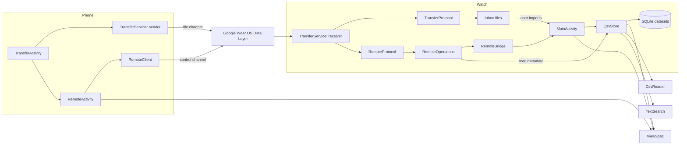
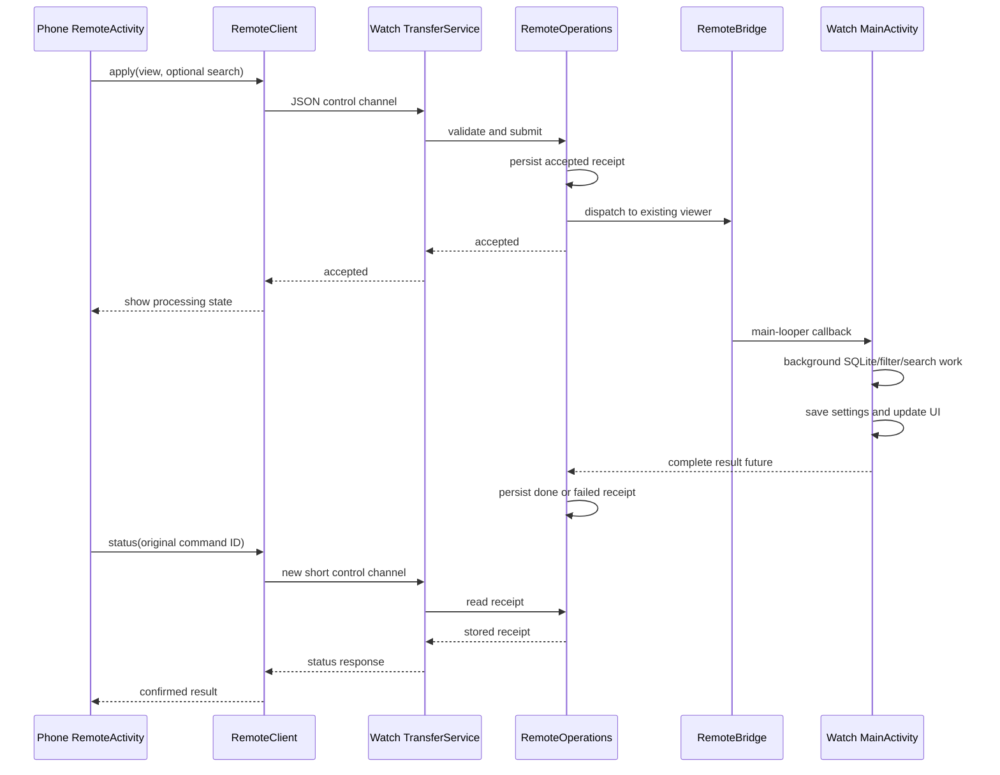

# Watch CSV: code structure, component relationships, and libraries

[User guide](README.md) · [Руководство на русском](README.ru.md)

This document describes the implementation of **version 1.3**. Paths are relative to the Watch CSV project root. It is a developer reference; installation and user workflows are covered in the READMEs.

## Contents

- [1. Application structure](#1-application-structure)
- [2. Repository map](#2-repository-map)
- [3. Java components and relationships](#3-java-components-and-relationships)
- [4. Data model and persistence](#4-data-model-and-persistence)
- [5. CSV import, filtering, paging, and search](#5-csv-import-filtering-paging-and-search)
- [6. Phone-to-watch file transfer](#6-phone-to-watch-file-transfer)
- [7. Remote view controls](#7-remote-view-controls)
- [8. Threads, lifecycle, and permissions](#8-threads-lifecycle-and-permissions)
- [9. Libraries and dependencies](#9-libraries-and-dependencies)
- [10. Build pipeline](#10-build-pipeline)
- [11. Tests and verification](#11-tests-and-verification)
- [12. Where to make changes](#12-where-to-make-changes)

## 1. Application structure

Watch CSV uses native Android activities, programmatically constructed views, direct SQLite access, and explicit background executors. Both APKs compile the **same Java sources** and use the same application ID and signing key. Manifest selection determines the launcher and device requirements.

| Property | Watch build | Phone build |
|---|---|---|
| Manifest | [`AndroidManifest.xml`](AndroidManifest.xml) | [`phone/AndroidManifest.xml`](phone/AndroidManifest.xml) |
| Output | `build/watch-csv.apk` | `build/watch-csv-companion.apk` |
| Launcher label | Watch CSV | Watch CSV Companion |
| Launcher activity | `MainActivity` | `TransferActivity` |
| Watch hardware feature | Required | Optional |
| Local CSV viewer | Available | Available through the companion |
| Application ID | `dev.watchcsv.viewer` | `dev.watchcsv.viewer` |

The current settings are minimum Android **API 30**, target **API 35**, and default compile platform **API 36**. Java is compiled with source/target level 8. Both manifests identify version `1.3`, version code `5`.

The matching application ID and certificate allow the two installations to communicate through Google Wear OS Data Layer. Each device still has its own private files and preferences: using the same package name does not synchronize its databases automatically.

## 2. Repository map

```text
.
├── AndroidManifest.xml              Watch application manifest
├── phone/AndroidManifest.xml        Phone application manifest
├── res/drawable/ic_launcher.xml     App icon; layouts are built in Java
├── src/dev/watchcsv/viewer/
│   ├── BackActivity.java            Shared Android Back handling
│   ├── MainActivity.java            Local viewer and watch command target
│   ├── TransferActivity.java        Phone transfer UI / watch receive UI
│   ├── RemoteActivity.java          Phone editor for watch-owned views
│   ├── CsvReader.java               Streaming CSV parser
│   ├── CsvStore.java                SQLite import and result queries
│   ├── ViewSpec.java                Selection, order, filters, and row sort
│   ├── TextSearch.java              Literal occurrence matching
│   ├── TransferService.java         Foreground transfer/control receiver
│   ├── TransferProtocol.java        Binary CSV transfer protocol
│   ├── RemoteClient.java            Phone-side control-channel connection
│   ├── RemoteProtocol.java          Framed JSON control protocol
│   ├── RemoteOperations.java        Watch metadata and command receipts
│   └── RemoteBridge.java            In-process bridge to the watch viewer
├── prepare_deps.py                  Downloads/resolves Google Maven libraries
├── build_apks.py                    Compiles, packages, and signs both APKs
├── build.sh                        Build entry point
├── test.sh                         Local JVM tests
├── build-tests.sh                  Android instrumentation APK builder
├── tests/                          Test cases, runner, manifest, JSON helper
├── README.md                       English user guide
├── README.ru.md                    Russian user guide
└── ARCHITECTURE.md                  This document
```

Generated/local directories are ignored by Git:

| Directory | Contents |
|---|---|
| `build/` | Compiled classes/resources/DEX, APKs, and test output |
| `deps/` | Downloaded POM/AAR/JAR files, unpacked libraries, dependency report, test-only JSON JAR |
| `keys/` | Local development signing keystore |
| `__pycache__/` | Python bytecode cache |

These build directories are separate from the **on-device runtime storage** described below.

## 3. Java components and relationships

### UI and application orchestration

| Class | Responsibilities | Main relationships |
|---|---|---|
| [`BackActivity`](src/dev/watchcsv/viewer/BackActivity.java) | Routes legacy `onBackPressed()` and Android 13+ `OnBackInvokedCallback` to `navigateBack()`. Registers/unregisters the modern callback with the activity lifecycle. | Base class of all three app activities. |
| [`MainActivity`](src/dev/watchcsv/viewer/MainActivity.java) | File library, import options, row pages/details, filters, column ordering, presets, search, clipboard, and watch-side application of remote settings. Owns the current store, applied `spec`, editable `draft`, page, and search hit. | Uses `CsvStore`, `ViewSpec`, `TextSearch.Hit`; implements `RemoteBridge.Target`; launches `TransferActivity`. |
| [`TransferActivity`](src/dev/watchcsv/viewer/TransferActivity.java) | Uses `FEATURE_WATCH` to choose receive controls or phone sending controls. Handles file selection, receiver discovery, notification permission, and progress display. | Starts/stops `TransferService`; uses Wear OS capabilities; launches `MainActivity` and `RemoteActivity`. |
| [`RemoteActivity`](src/dev/watchcsv/viewer/RemoteActivity.java) | Loads watch metadata and edits a phone-side draft of the watch view. Sends apply/search commands and polls receipts. | Uses `RemoteClient`, `RemoteProtocol`, and `ViewSpec`; does not query the phone's local `CsvStore` for watch data. |

`MainActivity` and `RemoteActivity` use a `screen` identifier and render methods for in-activity navigation. The viewer's settings screens are not separate activities or fragments. `BackActivity` provides the common system entry point; individual activities decide which screen to return to.

### Data and protocol components

| Class | Responsibilities | Boundary |
|---|---|---|
| [`CsvReader`](src/dev/watchcsv/viewer/CsvReader.java) | Decode and parse one CSV record at a time, including BOMs, quoted fields, embedded newlines, and escaped quotes. | Java streams/charsets only; independent of Android UI and SQLite. |
| [`CsvStore`](src/dev/watchcsv/viewer/CsvStore.java) | Import datasets, read metadata, materialize filtered/sorted row IDs, load pages, and scan for search hits. | Uses Android `SQLiteDatabase`, `ViewSpec`, `CsvReader`, and `TextSearch`. |
| [`ViewSpec`](src/dev/watchcsv/viewer/ViewSpec.java) | Defines a view, moves columns, compiles filters, serializes JSON, and validates presets/remote settings. | Shared by local UI, remote UI, database queries, and protocols; uses Java and `org.json`. |
| [`TextSearch`](src/dev/watchcsv/viewer/TextSearch.java) | Finds forward/backward literal occurrences while preserving character offsets for highlighting. | Java regex API only. |
| [`TransferProtocol`](src/dev/watchcsv/viewer/TransferProtocol.java) | Stages files, calculates SHA-256, exchanges file metadata/payload/receipts, and publishes verified files. | Java streams/files only; unaware of Wear OS channel APIs. |
| [`TransferService`](src/dev/watchcsv/viewer/TransferService.java) | Owns foreground sessions, channels, notifications, timeouts, wake locks, and dispatch to file/control protocols. | Android service plus Google Play services. |
| [`RemoteClient`](src/dev/watchcsv/viewer/RemoteClient.java) | Verifies remote capability, opens one control channel per request, enforces deadlines, and closes transport resources. | Google channel/task APIs wrapped around `RemoteProtocol`. |
| [`RemoteProtocol`](src/dev/watchcsv/viewer/RemoteProtocol.java) | Versioned JSON framing, request validation, view validation, response correlation, and stream exchange. | Java streams and `org.json`; transport-independent. |
| [`RemoteOperations`](src/dev/watchcsv/viewer/RemoteOperations.java) | Reads watch metadata, records command acceptance/results, prevents concurrent mutations, and recovers interrupted receipts. | Android preferences, `CsvStore` metadata, and `RemoteBridge`. |
| [`RemoteBridge`](src/dev/watchcsv/viewer/RemoteBridge.java) | Posts a command to the main looper and returns a `CompletableFuture` for the existing viewer's result. | Holds a weak reference to `RemoteBridge.Target`; does not launch an activity. |

### Main dependency graph



The phone also contains `MainActivity` and the local data components for its local viewer. That installation's data is independent of the watch-owned data edited through `RemoteActivity`.

## 4. Data model and persistence

### Dataset storage

Each successful import becomes a separate SQLite file:

```text
getFilesDir()/datasets/<UUID>.db
```

There is no separate catalog database. `CsvStore.library()` enumerates `.db` files and reads each file's metadata. A dataset filename, including `.db`, is also its remote-control identifier.

The schema below shows a three-column dataset; `c0 … cN` are generated from the number of source columns:

```sql
CREATE TABLE data (
    _id INTEGER PRIMARY KEY,
    c0 TEXT NOT NULL,
    c1 TEXT NOT NULL,
    c2 TEXT NOT NULL
);

CREATE TABLE metadata (
    name TEXT NOT NULL,
    headers TEXT NOT NULL,
    row_count INTEGER NOT NULL
);

CREATE TABLE view_rows (
    pos INTEGER PRIMARY KEY,
    row_id INTEGER NOT NULL UNIQUE
);
```

- `metadata` contains one record. `headers` is a JSON array of display names.
- `_id` is a one-based imported data-row ID, excluding the header. Blank lines skipped during import do not receive IDs.
- `c0`, `c1`, etc. are stable **source-column IDs**, regardless of displayed names or column reordering.
- `view_rows` is a persisted table of the current filtered/sorted results, not an SQL view. `pos` is zero-based; `row_id` refers logically to `data._id` but has no declared foreign-key constraint.
- Opening/applying a view rebuilds `view_rows`. It is a result index, not another copy of all cell values.

`CsvStore.Info` carries dataset metadata. `CsvStore.Row` carries a result position, source row ID, and a `cells[]` array indexed by source-column ID. Hidden columns have `null` entries in page results.

### ViewSpec

`ViewSpec` is the shared view configuration. Its arrays are indexed by source-column ID, except `order`, whose entries map display position to source-column ID.

```json
{
  "visible": [true, false, true],
  "filters": ["", "^A", ""],
  "regex": [false, true, false],
  "sort": 0,
  "descending": false,
  "order": [2, 0, 1]
}
```

This displays source columns 2 and 0, filters hidden source column 1 using `^A`, and sorts rows by source column 0. `sort: -1` means original row order.

Important invariants:

- Reordering changes only `order`; it does not move cells, filters, or visibility flags between source IDs.
- `order` must be a permutation containing every source column exactly once.
- Applied views require at least one visible column and valid regexes.
- `copy()` clones the arrays so editing a draft does not mutate the applied view.
- `from()` validates an applicable view. `fromDraft()` permits temporarily invalid regexes/empty selections while restoring a phone editor draft, but still validates structural order and sort constraints.
- Older presets without `order` load with identity order: `[0, 1, 2, …]`.

### Preferences and transient state

| Preference file / key | Purpose |
|---|---|
| `views` / `last:<dataset-id>` | Last applied `ViewSpec` JSON for a dataset |
| `views` / `presets:<dataset-id>` | JSON object mapping preset names to view specifications |
| `views` / `search:<dataset-id>` | Last search text |
| `views` / `activeFile` | Current/last-opened dataset reference used by the companion; cleared when opening the file library |
| `remote-receipts` / `result:<command-id>` | Watch-side JSON receipt with `accepted`, `done`, or `failed` status |
| `remote-receipts` / `history` | IDs used to retain the latest 16 command receipts |
| `phone-control` / `pending:<watch-node-id>` | Phone-side ID of a command awaiting confirmation |
| Activity-private `TransferActivity` preferences / `notificationsAsked` | Whether the notification permission explanation/request has already been shown |

The current result page, highlighted `TextSearch.Hit`, and `TransferService.Status` are in-memory state. The remote editor saves its draft in Android activity instance state for recreation/rotation; it is not a durable preset automatically saved when the activity is explicitly closed.

Additional file locations:

| Location | Purpose |
|---|---|
| `getExternalFilesDir(null)/Inbox/` | Received CSV files awaiting user import; usually `/sdcard/Android/data/dev.watchcsv.viewer/files/Inbox/` |
| `getCacheDir()/transfers/outgoing-*.partial` | Phone staging copy used for length and checksum calculation |
| `Inbox/incoming-*.partial` | Watch file currently being received and verified |
| `getFilesDir()/datasets/<UUID>.partial` | Database currently being imported |

## 5. CSV import, filtering, paging, and search

### Import pipeline

```text
Document-picker URI or Inbox file
  → InputStream
  → CsvReader: BOM/charset + delimiter + quoted-record parsing
  → CsvStore.importFile(): prepared SQLite inserts into <UUID>.partial
  → metadata record + successful transaction
  → close database and rename to <UUID>.db
  → MainActivity opens the dataset
```

`CsvReader` recognizes UTF-8/UTF-16 BOMs before using the selected encoding. Its decoder reports malformed input. Delimiter detection examines up to 65,536 characters of the first record, counting comma, semicolon, tab, and pipe outside quotes. Parsing then proceeds one record at a time.

`CsvStore` assigns distinct display names to duplicate/empty headers, pads short rows, and rejects rows wider than the header. It uses one transaction for data/metadata inserts. A normal failure or cancellation deletes the partial database; a process kill can leave an ignored partial file.

The import explicitly selects `journal_mode=DELETE` so the completed database can be renamed without depending on a separate WAL file. This PRAGMA uses `rawQuery()` and advances the cursor because it returns a result row. Database cache size is configured as approximately 2 MiB.

Limits are 256 columns, 500,000 characters per imported data row, and a parser-level limit of 1,000,000 characters per field.

### Applying a view

1. `ViewSpec.patterns()` compiles active filters. Literal filters are escaped with `Pattern.quote`; regex filters are used as expressions. Matching is case-insensitive and Unicode-aware.
2. `CsvStore.apply()` scans `_id` and the actively filtered source columns in SQL sort order.
3. Every active filter must match (`AND`). A hidden column can still filter or sort the rows.
4. Accepted row IDs are inserted into `view_rows` with consecutive positions inside a transaction.
5. `CsvStore.page()` joins those IDs to `data` and loads at most **12 rows**, selecting only visible cell columns.

Row sorting uses SQLite text ordering with `COLLATE NOCASE` and `_id ASC` as the tie-breaker. Without a selected sort column, rows use `_id ASC`. Regex filtering runs in Java, not as a SQLite regex function. No full-text or per-column text index is created: applying filters scans the dataset, and arbitrary-column sorting may require SQLite temporary storage.

The UI limits row-card previews and pages very long cell text separately. Paging bounds rendering/memory use; it does not make full-dataset filtering or sorting constant-time.

### Search pipeline

`CsvStore.search()` traverses `view_rows` in the requested direction and selects visible columns in `ViewSpec.order`. `TextSearch.inCell()` then finds literal, case-insensitive occurrences.

A `TextSearch.Hit` records:

- `position`: zero-based position in the filtered/sorted results;
- `column`: immutable source-column ID;
- `start` / `end`: offsets in the original Java string, suitable for Android text spans.

Navigation compares row position, **display rank**, and occurrence offset, so moving a source column does not break previous/next search. Repeated non-overlapping matches in one cell are navigable. Search does not wrap automatically or precompute all hits.

## 6. Phone-to-watch file transfer

### Connection and ownership

The user starts a watch receive session through `TransferActivity`. `TransferService` runs as a foreground `dataSync` service, registers a `ChannelClient.ChannelCallback`, and advertises two local capabilities:

| Purpose | Capability | Channel path prefix |
|---|---|---|
| File transfer | `watchcsv_receiver_v1` | `/watchcsv/transfer/v1/` |
| Remote controls | `watchcsv_control_v1` | `/watchcsv/control/v1/` |

Paths append a new UUID for each channel. The phone discovers reachable capability nodes and opens a channel to the selected node. Data Layer provides connectivity between the paired installations; the app does not implement its own Bluetooth stack or HTTP server.

`TransferService` exists independently on each device. On the phone it opens source URIs and calls `TransferProtocol.stage()` / `send()`. On the watch it calls `receive()` and writes to Inbox. Importing the received CSV into SQLite remains a separate user action.

### File protocol

All binary integers use Java `DataInputStream` / `DataOutputStream` encoding (big-endian). Filename/message strings in this protocol use `writeUTF` / `readUTF` (Java modified UTF-8).

```text
Phone                                           Watch
  stage source file; calculate size + SHA-256
  magic + version + filename + length + digest  → validate header/space; create partial file
                                               ← READY
  exactly length bytes + END                   → write, verify digest, sync, publish in Inbox
                                               ← SAVED + resulting filename
  courtesy CONFIRM                             → close exchange
```

Magic constants are `0x57435356` (header), `0x5741434B` (reply), `0x57454E44` (end), and `0x57444F4E` (confirmation). Reply statuses are `READY=1`, `SAVED=2`, and `ERROR=3`; each reply also carries a UTF message.

The successful sender outcome is receipt of **SAVED**, not merely finishing its output stream. Losing the final courtesy confirmation does not undo an already saved file. If the watch saves a file but cannot deliver its receipt, `ReceiptLostException` preserves that distinction.

Payload buffers are 64 KiB. The size limit is 256 MiB per file. The receiver sanitizes names, verifies the advertised byte count/end marker/SHA-256, and publishes only verified files. Existing filenames get numbered suffixes. Normal failures remove partial files; abrupt process death can leave partials. Transfers restart from the beginning rather than resuming by offset.

## 7. Remote view controls

### End-to-end relationship



Remote requests reuse the watch viewer's data path. `RemoteOperations` reads metadata itself, but mutations/search are routed through `MainActivity.remoteCommand()`. This avoids an independent service-side writer rebuilding the viewer's result table while the viewer is using it. Dispatch and completion are asynchronous; a fast command can finish before the phone's first status poll.

### JSON framing and operations

`RemoteProtocol` uses a four-byte byte-length prefix followed by **standard UTF-8 JSON**, capped at 512 KiB. The client sends one integer receipt after reading a response, allowing the receiver to close the exchange. Client responses must match the request's `id` and protocol `v`.

Example apply request for a three-column CSV:

```json
{
  "v": 1,
  "id": "11111111-2222-3333-4444-555555555555",
  "op": "apply",
  "file": "aaaaaaaa-bbbb-cccc-dddd-eeeeeeeeeeee.db",
  "view": {
    "visible": [true, false, true],
    "filters": ["", "^A", ""],
    "regex": [false, true, false],
    "sort": 0,
    "descending": false,
    "order": [2, 0, 1]
  },
  "search": "example",
  "direction": "first"
}
```

`search` is optional for `apply`. Including it applies the view and performs the requested search; an empty string clears search. Search-only commands use the watch's applied view rather than the phone's unsent draft.

| Operation | Additional request fields | Handling/result |
|---|---|---|
| `list` | None | Imported file summaries and optional `active` dataset ID |
| `get` | `file` | Headers, row count, name, applied `view`, and saved search text |
| `apply` | `file`, `view`; optional `search`, `direction` | Asynchronous command handled by the watch viewer |
| `search` | `file`, `search`; optional `direction` | Asynchronous first/next/previous occurrence navigation; may open the selected dataset |
| `status` | `command` | Stored receipt for the original mutation/search command |

Every response has `v`, `id`, `status`, `message`, and a `data` object. The actual **wire status values are `accepted`, `done`, and `failed`**. User-facing text such as “View applied on watch” describes a `done` result.

A `status` response uses its own request ID in the outer envelope. `data.result` contains the original command's receipt and original ID. File IDs must have the UUID-based `.db` form. Search is limited to 4096 characters and each remote filter to 8192 characters.

### Command state and viewer lifetime

- Only one mutation/search command is active at a time. A different concurrent command is rejected; it is not silently queued as another view change.
- The accepted receipt is committed before dispatch. A separate receipt executor records completion from the viewer's future.
- Reusing an ID with a retained receipt returns the prior receipt instead of executing it again. This is bounded deduplication for the last 16 commands, not a permanent exactly-once log.
- A new receive session calls `recover()`; persisted accepted commands without a live execution become failed/interrupted. They are not replayed automatically.
- `RemoteBridge` keeps a weak reference to an existing watch `MainActivity`. It attaches on creation/resume and detaches on destruction. The viewer may be behind another screen, but must still exist.
- Missing viewer, active database work, or a watch-side settings draft produces a failed command instead of starting an activity or discarding local edits.
- Applying results in SQLite and committing preferences are separate steps. If the viewer/process closes before confirmation, the phone must reload state rather than assume nothing changed.
- Search receipts include result counts and, when available, match position/column metadata. Control messages do not stream the dataset's cell rows back to the phone.

## 8. Threads, lifecycle, and permissions

### Execution contexts

| Owner | Background work | Main-thread work |
|---|---|---|
| `MainActivity` | One executor for import, database access, filtering, paging, search, and remote view application | Rendering, screen transitions, progress, receipt-future completion after UI update |
| `TransferActivity` | Receiver discovery using Google tasks | File picker, permission dialog, controls; polls process-local `TransferService.Status` every 500 ms |
| `TransferService` | One executor for file exchanges and short control requests | Service lifecycle, foreground notifications, channel callbacks, watchdog |
| `RemoteActivity` | One executor for remote calls | Phone draft/editor; polls accepted command status while resumed |
| `RemoteClient` | Blocking Google task waits/stream I/O on the caller's worker; scheduled deadline executor | No UI ownership |
| `RemoteOperations` | Metadata work on the service worker; separate executor for receipt persistence | Dispatches through `RemoteBridge` rather than mutating activity state directly |

The receive queue allows up to four admitted channels, including any being processed. File and control exchanges share the receiver's worker, so a file transfer can delay a control request. Long-running CSV filtering is handed off to the viewer worker after the short control exchange is accepted.

Database cancellation uses an `AtomicBoolean` and thread interruption checks between records/matches. A single expensive Java regex evaluation is not interrupted in its middle by these checks. Transfer cancellation also closes streams/channels to unblock I/O.

### Timeouts and lifetime

| Mechanism | Current setting |
|---|---|
| Idle receive session | 10 minutes |
| In-progress exchange without progress | 3 minutes |
| Transfer/session work limit used by the service watchdog | 45 minutes per active exchange/file |
| Service/remote client Google task wait | 30 seconds per awaited task |
| `RemoteClient` RPC deadline | 45 seconds per short exchange |
| Remote viewer work wake lock | Up to 15 minutes; normally released on completion/failure/destruction |

Local viewer jobs request `FLAG_KEEP_SCREEN_ON`. Transfers use partial wake locks. `TransferService` returns `START_NOT_STICKY`; process death does not automatically restart a transfer session. Completed databases, view preferences, and receipts survive process restarts; in-memory progress and active stream state do not.

`view_rows` is one materialized result table per dataset. The current design routes remote mutations through the existing viewer; adding independent writers or simultaneous views would require coordination or separate result tables.

### Android integration

- `ACTION_OPEN_DOCUMENT` grants access to user-selected CSVs; the watch viewer also tries `ACTION_GET_CONTENT` as a fallback. Phone transfer selections take persistable read grants when the provider supports them.
- The manifest declares `FOREGROUND_SERVICE`, `FOREGROUND_SERVICE_DATA_SYNC`, `WAKE_LOCK`, and `POST_NOTIFICATIONS`. Android 13+ notification permission is requested through `TransferActivity`; denial still permits in-app progress and foreground work under Android's rules.
- The app uses the platform clipboard and its app-specific Inbox; it does not request broad storage, media, direct Bluetooth, or app Internet permissions.
- Both manifests include the Google Play services version metadata, a package-visibility query for `com.google.android.gms`, and `GoogleApiActivity` for supported resolution flows.
- Transfer/control reception is through a registered channel callback in the user-started foreground service, not a manifest `WearableListenerService`.

## 9. Libraries and dependencies

### Platform and standard Java APIs

| API | Use in this project |
|---|---|
| Android `Activity`, views/widgets, Material platform theme | Programmatic UI and navigation |
| Android `SQLiteDatabase`, `Cursor`, `SQLiteStatement` | Persistent datasets, transactions, prepared inserts, and page queries |
| Android `SharedPreferences` / `Bundle` | Saved views, presets, command receipts, and activity-state restoration |
| Android `ContentResolver`, document intents, clipboard | Selected-file streams, metadata, and copy/paste |
| Android `Service`, notifications, `PowerManager` | User-visible foreground sessions and bounded wake locks |
| Android `org.json` | Preset/view serialization and remote JSON |
| Java streams, charsets, `java.nio.file` | Streaming parsing, framing, file staging, and publication |
| `java.util.regex` | Contains/regex filters and literal search with highlight offsets |
| `MessageDigest` | SHA-256 file-transfer integrity |
| `ExecutorService`, `Handler`, `CompletableFuture`, atomic types | Background work, UI delivery, cancellation, and asynchronous remote receipts |

### Google Play services

The declared entry dependency is **`com.google.android.gms:play-services-wearable:19.0.0`**. The other Google libraries are resolved transitively. Versions below come from the current generated `deps/resolved.json`.

| Artifact | Version | Role |
|---|---|---|
| `play-services-wearable` | `19.0.0` | `Wearable`, `ChannelClient`, `CapabilityClient`, `CapabilityInfo`, and `Node`: stream channels and discover receiving watches |
| `play-services-base` | `18.5.0` | Google API client/resolution infrastructure, including availability UI used by `TransferActivity` |
| `play-services-basement` | `18.4.0` | Shared Google API primitives, availability checks, status/connection support, and version resources |
| `play-services-tasks` | `18.2.0` | `Task` results/listeners and timed `Tasks.await()` calls for Google APIs |

Google `Task` and Java `CompletableFuture` serve different boundaries: the former wraps Play services calls; the latter links `RemoteBridge`, the watch activity, and receipt persistence.

### AndroidX libraries in the resolved graph

These are packaged **transitive support libraries**. The app's own activities extend platform `Activity` through `BackActivity`; the presence of Fragment, ViewModel, or LiveData dependencies does not mean the viewer is implemented with those architectures.

| Artifact | Version | Library purpose |
|---|---|---|
| `androidx.activity:activity` | `1.0.0` | Activity infrastructure used by AndroidX dependents |
| `androidx.annotation:annotation` | `1.1.0` | API/nullability/resource annotations |
| `androidx.arch.core:core-common` | `2.1.0` | Common architecture-component interfaces |
| `androidx.arch.core:core-runtime` | `2.0.0` | Architecture-component task execution support |
| `androidx.asynclayoutinflater:asynclayoutinflater` | `1.0.0` | Asynchronous layout inflation support |
| `androidx.collection:collection` | `1.1.0` | Android-oriented collection implementations |
| `androidx.coordinatorlayout:coordinatorlayout` | `1.0.0` | Coordinated layout/behavior support |
| `androidx.core:core` | `1.2.0` | Framework compatibility helpers and resources |
| `androidx.cursoradapter:cursoradapter` | `1.0.0` | Cursor-backed adapter support |
| `androidx.customview:customview` | `1.0.0` | Custom-view compatibility/accessibility helpers |
| `androidx.documentfile:documentfile` | `1.0.0` | Document-provider wrapper APIs |
| `androidx.drawerlayout:drawerlayout` | `1.0.0` | Drawer UI component |
| `androidx.fragment:fragment` | `1.1.0` | Fragment infrastructure for dependents such as Google API UI integration |
| `androidx.interpolator:interpolator` | `1.0.0` | Animation interpolators |
| `androidx.legacy:legacy-support-core-ui` | `1.0.0` | Legacy support-UI dependency aggregate |
| `androidx.legacy:legacy-support-core-utils` | `1.0.0` | Legacy support-utility dependency aggregate |
| `androidx.lifecycle:lifecycle-common` | `2.1.0` | Lifecycle interfaces and observer support |
| `androidx.lifecycle:lifecycle-livedata` | `2.0.0` | Lifecycle-aware observable data support |
| `androidx.lifecycle:lifecycle-livedata-core` | `2.0.0` | Core LiveData implementation |
| `androidx.lifecycle:lifecycle-runtime` | `2.1.0` | Lifecycle runtime/registry support |
| `androidx.lifecycle:lifecycle-viewmodel` | `2.1.0` | ViewModel infrastructure |
| `androidx.loader:loader` | `1.0.0` | Loader lifecycle support |
| `androidx.localbroadcastmanager:localbroadcastmanager` | `1.0.0` | In-process broadcast helper |
| `androidx.print:print` | `1.0.0` | Printing helper APIs |
| `androidx.savedstate:savedstate` | `1.0.0` | Saved-state registry support |
| `androidx.slidingpanelayout:slidingpanelayout` | `1.0.0` | Sliding-pane UI component |
| `androidx.swiperefreshlayout:swiperefreshlayout` | `1.0.0` | Swipe-to-refresh UI component |
| `androidx.versionedparcelable:versionedparcelable` | `1.1.0` | Versioned parcel serialization support |
| `androidx.viewpager:viewpager` | `1.0.0` | Paged-view UI component |

The current report contains **33 runtime artifacts: four Google libraries and 29 AndroidX libraries**. Some libraries are retained from dependencies encountered before a higher version of a parent artifact was selected; the custom resolver does not prune obsolete dependency edges. This table describes what the builder currently packages, not a minimal dependency set.

### Test-only dependency

[`tests/fetch_json.py`](tests/fetch_json.py) downloads `com.vaadin.external.google:android-json:0.0.20131108.vaadin1` from Maven Central. It supplies Android-compatible `org.json` behavior to JVM tests. It is not in either application APK; Android supplies JSON at runtime.

### Dependency resolution

[`prepare_deps.py`](prepare_deps.py) starts from the pinned Wearable artifact, reads Google Maven POMs, follows non-optional compile/runtime dependencies, and keeps the highest encountered version per group/artifact. It downloads JARs or extracts AAR classes/resources/manifests into `deps/`.

This is a purpose-built resolver rather than a full Maven implementation: unresolved property-based coordinates fail, and it does not implement general parent/BOM dependency management. `deps/resolved.json` records coordinates, versions, artifact SHA-256 values, and local extraction paths. It is a generated report, not an input checksum lockfile; hashes are calculated after download.

## 10. Build pipeline

[`build.sh`](build.sh) invokes [`build_apks.py`](build_apks.py), optionally with `watch` or `phone`. The builder performs the following steps for each manifest variant:

```text
prepare_deps.py
  → AAR/JAR classes + resources + resource package names
  → aapt2 compile for library and app resources
  → aapt2 link with selected manifest and generated R classes
  → javac -source 8 -target 8 for app/generated sources
  → jar for compiled app classes
  → d8 for app + dependency bytecode (minimum API 30)
  → add classes*.dex to resource APK
  → zipalign
  → apksigner using the shared development keystore
  → signature and alignment verification
```

| Tool | Responsibility |
|---|---|
| Python standard library | HTTP downloads, POM/XML/JSON handling, ZIP extraction/packaging, process orchestration, and hashes |
| JDK: `javac`, `jar`, `keytool` | Compile Java, package classes, and create the development signing key if absent |
| Android platform `android.jar` | Compile-time Android APIs; defaults to `$ANDROID_HOME/platforms/android-36/android.jar` |
| Termux-compatible `aapt2` | Resource compilation/linking and generation of app/library R classes |
| `d8` | Convert Java class files to Android DEX |
| `zipalign` / `apksigner` | APK alignment, signing, and verification |
| `adb` | Optional device installation, diagnostics, and instrumentation execution |

The build uses all shared sources for both variants. It does not run a code shrinker. Library R classes are generated with `--extra-packages`; library resources are linked as overlays. Dependency manifest requirements are included manually in the two application manifests rather than processed by a general manifest merger.

The watch build also updates `build/classes.jar` and `build/classes/` for the instrumentation builder. Both APKs are signed using `keys/development.jks`; preserving that local key preserves update compatibility and the matching-certificate Data Layer identity.

```sh
bash build.sh          # Both applications
bash build.sh watch    # Watch only
bash build.sh phone    # Phone only
```

`ANDROID_HOME` selects the SDK root and `ANDROID_JAR` overrides the platform JAR path. The current workflow uses ARM-compatible tools from Termux's `PATH` rather than Gradle/Android Studio.

## 11. Tests and verification

### Local JVM tests

[`test.sh`](test.sh) compiles the portable classes and runs each test program with a **32 MiB maximum Java heap**.

| Test | Coverage | Current assertion count |
|---|---|---|
| [`CoreTest`](tests/CoreTest.java) | CSV decoding/parsing, malformed input, large streamed input, literal occurrence search, Unicode offsets, cancellation | 55 |
| [`TransferTest`](tests/TransferTest.java) | Duplex file exchange, receipts, exact bytes, naming/collisions, corrupt/truncated input, cleanup, large streamed transfer | 53 |
| [`ViewSpecTest`](tests/ViewSpecTest.java) | Column moves, stable source IDs, copied drafts, JSON/preset migration, invalid orders, ordered search | 59 |
| [`RemoteProtocolTest`](tests/RemoteProtocolTest.java) | Framed JSON RPC, setting/search preservation, response correlation, invalid requests, draft restoration, size limits | 64 |

These suites total **231 assertions**. The large parsing and file-transfer scenarios process 14,640,000 bytes without keeping the entire input in memory. The duplex tests use local Java streams rather than Google's actual Data Layer transport.

### Android instrumentation

[`build-tests.sh`](build-tests.sh) builds `build/watch-csv-tests.apk`, a separate test-only APK targeting `dev.watchcsv.viewer`.

- [`StoreTest`](tests/StoreTest.java) exercises real Android SQLite import, paging, filtering, sorting, reordered-column search, cancellation rollback, and Windows-1251 regression cases.
- [`RemoteStoreTest`](tests/RemoteStoreTest.java) tests metadata and receipt persistence against isolated Android files/preferences, with a controlled `RemoteBridge.Target` for async completion, deduplication, busy-state rejection, and recovery.
- [`StoreInstrumentation`](tests/StoreInstrumentation.java) runs the two suites and returns a result bundle to `am instrument`.

```sh
bash test.sh
bash build-tests.sh
adb install -r -t build/watch-csv-tests.apk
adb shell am instrument -w dev.watchcsv.viewer.tests/dev.watchcsv.viewer.StoreInstrumentation
```

Instrumentation requires an installed main app and a connected device. The local stream tests/build checks do not establish that watch buttons, lifecycle behavior, notification prompts, or the paired phone/watch transport have been verified on hardware. See the README's verification section for the recorded testing status.

## 12. Where to make changes

| Desired change | Primary files | Related checks |
|---|---|---|
| CSV syntax, encoding, delimiter behavior | `CsvReader.java`, import options in `MainActivity.java` | `CoreTest`, `StoreTest` |
| Import policy or database queries | `CsvStore.java` | `StoreTest` |
| Column selection/order/filter semantics | `ViewSpec.java`, `MainActivity.java`, `RemoteActivity.java`, `CsvStore.java` | `ViewSpecTest`, `RemoteProtocolTest`, `StoreTest` |
| Search/navigation/highlighting | `TextSearch.java`, `CsvStore.java`, both viewer/control activities | `CoreTest`, `ViewSpecTest`, `StoreTest` |
| Watch screen flow or Back behavior | `BackActivity.java`, `MainActivity.java`, manifests | On-device UI/back/keyboard checks |
| File-transfer format | `TransferProtocol.java`, `TransferService.java` | `TransferTest`; paired-device transfer |
| Remote operation or receipt behavior | `RemoteProtocol.java`, `RemoteOperations.java`, `RemoteBridge.java`, `MainActivity.remoteCommand()`, `RemoteActivity.java` | `RemoteProtocolTest`, `RemoteStoreTest`; paired-device command flow |
| Connection/session timing | `RemoteClient.java`, `TransferService.java`, `TransferActivity.java` | Disconnect, timeout, background, and retry checks on devices |
| Dependency versions or packaging | `prepare_deps.py`, `build_apks.py`, both manifests | Rebuild both APKs; inspect resources, manifest requirements, signatures, and device behavior |

When extending the model/protocol, preserve stable source-column IDs and define how older presets/messages are handled. File-transfer version, control-protocol version, and application version are separate: both channel protocols currently use version 1 while the APK version is 1.3.
